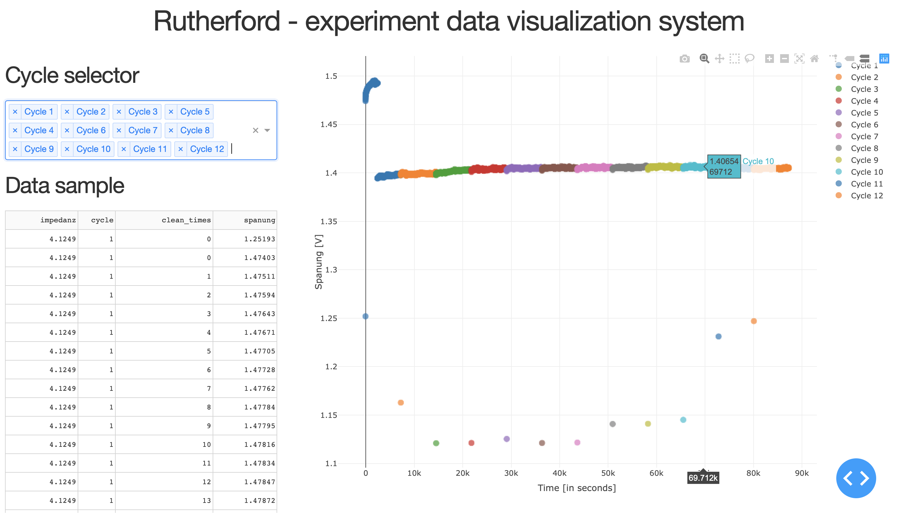

# Walter White
Project for analyzing chemical expirements results from flowcell EC-Lab.

## How-to 
- First, run all containers:
```
make run-appliance
```
- After start-up, trigger some data to be presented in database:
```
make trigger-test
```
- Finally, open the http://0.0.0.0:8050 link to get data visualization overview.

## Dashboard sample
